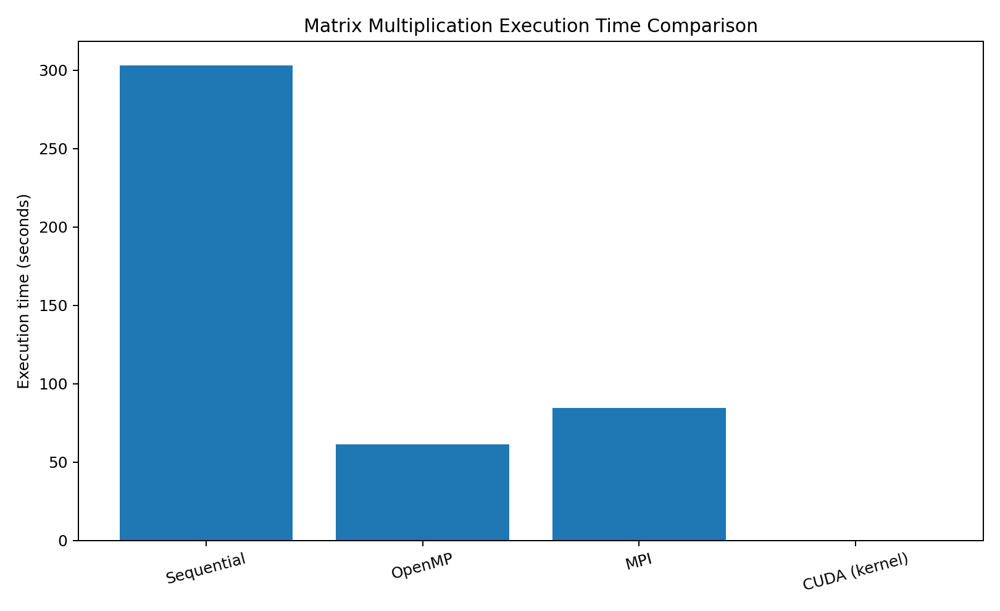
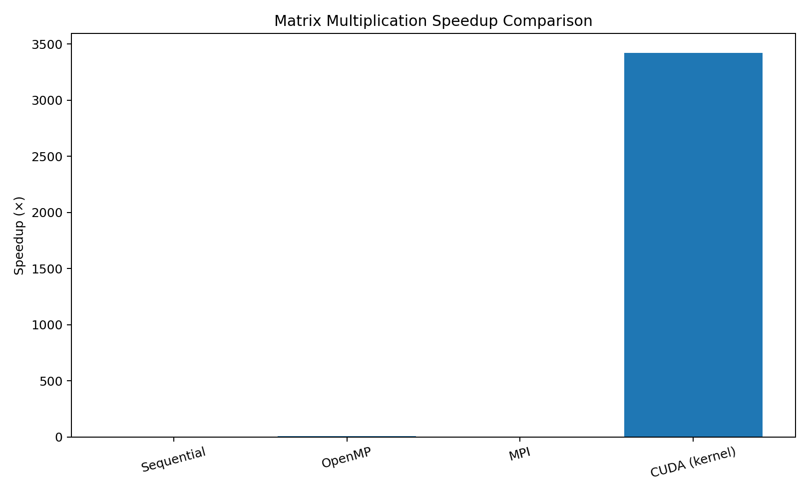
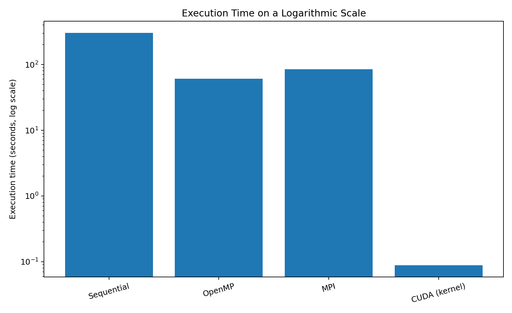

# Experiment 1 — Matrix Multiplication using Sequential, OpenMP, MPI and CUDA

## 1. Aim

This experiment implements the same matrix multiplication workload using four computing models:

- Sequential CPU execution
- OpenMP shared-memory parallelism
- MPI distributed-memory parallelism
- CUDA GPU parallelism

The laboratory manual defines a 4000 × 4000 matrix multiplication and uses the sequential execution as the baseline for speedup comparison.

## 2. Problem Definition

- Matrix A: 4000 × 4000, elements initialized to 1.0
- Matrix B: 4000 × 4000, elements initialized to 1.0
- C = A × B
- Expected mathematical verification: `C[0][0] = 4000.00`

The reference manual specifies the execution flow as Sequential → OpenMP → MPI → CUDA and compares their performance. 

## 3. Implementations

### Part A — Sequential

The sequential version performs the complete matrix multiplication using one CPU execution flow.

### Part B — OpenMP

OpenMP parallelizes the outer matrix loop using multiple CPU threads. The captured run used 8 OpenMP threads.

### Part C — MPI

MPI distributes the matrix rows across multiple processes running on the VMware Ubuntu nodes. The captured run used 4 MPI processes.

### Part D — CUDA

CUDA executes the matrix multiplication kernel on the GPU. The captured CUDA configuration used a 16 × 16 block and a 250 × 250 grid.

## 4. Captured Results


| Implementation | Captured execution time | Speedup vs sequential | Captured verification |
|---|---:|---:|---:|
| Sequential | 303.118438 s | 1.00× | 4000.00 |
| OpenMP | 61.120517 s | 4.96× | 4000.00 |
| MPI | 84.497026 s | 3.59× | 4000.00 |
| CUDA (kernel) | 0.088590 s | 3421.59× | 4900.00 |


## 5. Performance Comparison

Speedup is calculated as:

`Speedup = Sequential Execution Time / Parallel Execution Time`

For the captured runs:

- OpenMP: `303.118438 / 61.120517 = 4.96×`
- MPI: `303.118438 / 84.497026 = 3.59×`
- CUDA kernel: `303.118438 / 0.088590 = 3421.59×`

## 6. Graphs

### Execution Time



### Speedup



### Log-Scale Execution Time



## 7. Screenshots


### Sequential and OpenMP

- `01_sequential_source_and_execution.png`
- `02_openmp_source_and_execution.png`
- `03_openmp_compilation_and_manual_result.png`
- `04_cpu_monitoring_htop.png`
- `05_sequential_compilation_error_and_fix.png`
- `06_sequential_execution_attempt.png`

### MPI

- `07_mpi_node_ip_setup.png`
- `08_worker1_ip.png`
- `09_worker2_ip.png`
- `10_worker3_ip_and_cluster.png`
- `11_mpi_network_connectivity.png`
- `12_mpi_network_and_ssh_setup.png`
- `13_openssh_installation.png`
- `14_openssh_and_package_setup.png`
- `15_openmpi_installation_and_version.png`
- `16_ssh_key_and_openmpi_setup.png`
- `17_ssh_copy_id_hostname_errors.png`
- `18_mpi_run_output.png`
- `19_mpi_scp_and_execution.png`
- `20_mpi_final_result.png`

### CUDA

- `21_cuda_execution_result.png`
- `22_cuda_nvcc_version.png`

## 8. Observations

1. OpenMP reduced the execution time substantially by distributing the outer-loop work among CPU threads.
2. MPI also reduced execution time, but distributed-memory communication and VMware network overhead affected performance.
3. CUDA produced the smallest captured kernel execution time.


## 9. Conclusion

The experiment demonstrates the performance differences between sequential execution, shared-memory OpenMP parallelism, distributed-memory MPI parallelism, and GPU-based CUDA parallelism. The captured results show substantial performance improvement from parallel execution, with the CUDA kernel providing the lowest measured computation time.

## Repository Structure

```text
Experiment-1-Matrix-Multiplication/
├── README.md
├── screenshots/
│   ├── 01_sequential_source_and_execution.png
│   ├── 02_openmp_source_and_execution.png
│   ├── 03_openmp_compilation_and_manual_result.png
│   ├── 04_cpu_monitoring_htop.png
│   ├── 05_sequential_compilation_error_and_fix.png
│   ├── 06_sequential_execution_attempt.png
│   ├── 07_mpi_node_ip_setup.png
│   ├── 08_worker1_ip.png
│   ├── 09_worker2_ip.png
│   ├── 10_worker3_ip_and_cluster.png
│   ├── 11_mpi_network_connectivity.png
│   ├── 12_mpi_network_and_ssh_setup.png
│   ├── 13_openssh_installation.png
│   ├── 14_openssh_and_package_setup.png
│   ├── 15_openmpi_installation_and_version.png
│   ├── 16_ssh_key_and_openmpi_setup.png
│   ├── 17_ssh_copy_id_hostname_errors.png
│   ├── 18_mpi_run_output.png
│   ├── 19_mpi_scp_and_execution.png
│   ├── 20_mpi_final_result.png
│   ├── 21_cuda_execution_result.png
│   └── 22_cuda_nvcc_version.png
└── graphs/
    ├── execution_time_comparison.png
    ├── speedup_comparison.png
    └── execution_time_log_scale.png
```
